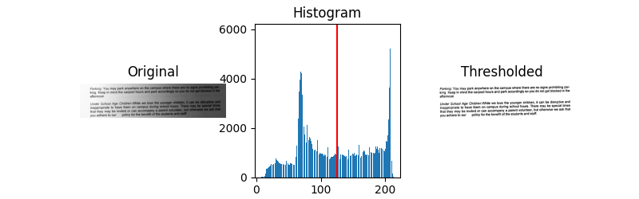

# Otsuthreshold
Otsu thresholding algorithm for converting grayscale images to binary images. We compare this algorithm with adaptive thresholding for OCR functionalities.

OCR is performed using Tesseract, do install Tesseract to run these files. 

## 1.1. Otsu thresholding applied to Image 1

## 1.2. Adaptive thresholding applied to Image 1

## 2.1. Otsu thresholding applied to Image 2

## 2.2. Adaptive thresholding applied to Image 2

OCR results are generated through tesseract which takes the thresholded binary image as an input:
|  | Otsy threshold | Adaptive threshold |
| --- | --- | --- |
| Image1 |  |
| Image2 |   |
